# 🤖 Honest Paper Trading Bot

<div align="center">


### *Real prices · Fake money · Real fees · Real learning*

> A paper-trading bot whose **only rule is honesty** — no faked fills, no rounded-away losses, no paraphrased-as-real news.

[✨ Features](#-features) · [🏗️ Architecture](#%EF%B8%8F-architecture) · [🚀 Quick Start](#-quick-start) · [📊 Workflows](#-workflow-graphs)

</div>

---

## 🎬 What is this?

Imagine you want to learn trading **without losing real money**. That's what a *paper trading bot* does — it trades with **fake money** using **real market prices** so you can practice and validate strategies safely.

But here's the catch: most paper trading bots **cheat**. They:
- ❌ Fake fills at nicer prices than reality
- ❌ Hide fees ("oh that trade was free!")
- ❌ Round away losses to make the chart look pretty
- ❌ Make up "news" to justify trades

**This bot refuses to cheat.** It's built on a single prime directive:

> ### 🔒 *Never fake a fill, a price, a fee, or a P&L number.*

Every trade, every fee, every price comes from a **real, verified source** with a timestamp and a hash you can audit later.

---

## ✨ Features

<table>
<tr>
<td width="50%">

### 🎯 Core
- ✅ **Real-time prices** from Binance, Yahoo Finance, Stooq
- ✅ **Real fees** from published exchange schedules (VIP0)
- ✅ **Slippage model** derived from live order book spreads
- ✅ **Perpetual funding** applied at venue's real cadence
- ✅ **Immutable trade ledger** — corrections are new rows, never edits

</td>
<td width="50%">

### 🛡️ Safety
- 🔒 **Per-broker live gate** — no global "go live" switch
- 🔒 **Human-only flag flips** — code can never enable live trading
- 🔒 **NO_FILL protocol** — bot refuses to trade if data is missing
- 🔒 **Sourced fees** — every number cited in `SOURCES.md`
- 🔒 **Audit trail** — every fill has `source_url` + `response_hash`

</td>
</tr>
<tr>
<td width="50%">

### 🧠 Strategies
- 📈 **SMA Crossover** — classic trend follower
- 📊 **RSI Mean Reversion** — buy oversold, sell overbought
- 🚀 **Donchian Breakout** — trade the range break
- 🤖 **ML Predictor** — online logistic regression

</td>
<td width="50%">

### 📊 Dashboard
- 🌐 **Glassmorphic web UI** at `localhost:8000`
- 📉 **Live equity curve** with Chart.js
- 💼 **Open positions** + **trade history**
- 📰 **News feed** with source links
- 🎛️ **Pause/resume** + manual order controls

</td>
</tr>
</table>

---

## 🎬 Animated Demo — How a Trade Flows

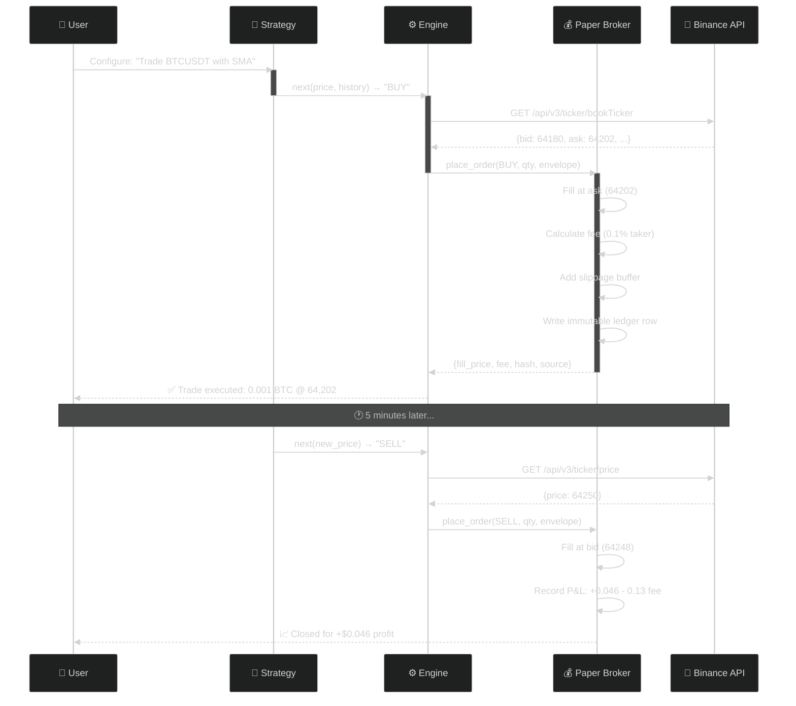

---

## 🏗️ Architecture

### System Overview

<div align="center">

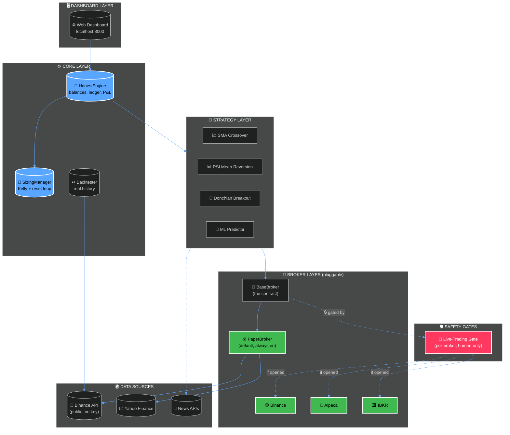

</div>

### The Broker-Agnostic Contract

Every broker — paper or real — must implement **exactly 6 methods**:

```mermaid
%%{init: {'theme':'dark'}}%%
flowchart LR
    A[Any Adapter] -->|must implement| B[BaseBroker]
    B --> M1["📊 get_quote()"]
    B --> M2["📝 place_order()"]
    B --> M3["❌ cancel_order()"]
    B --> M4["💼 get_positions()"]
    B --> M5["💵 get_balance()"]
    B --> M6["📜 get_trade_history()"]

    style B fill:#58a6ff,stroke:#fff,stroke-width:3px,color:#000
    style M1 fill:#0d1117,stroke:#58a6ff
    style M2 fill:#0d1117,stroke:#58a6ff
    style M3 fill:#0d1117,stroke:#58a6ff
    style M4 fill:#0d1117,stroke:#58a6ff
    style M5 fill:#0d1117,stroke:#58a6ff
    style M6 fill:#0d1117,stroke:#58a6ff
```

---

## 📊 Workflow Graphs

### 1️⃣ Full Trading Cycle

<div align="center">

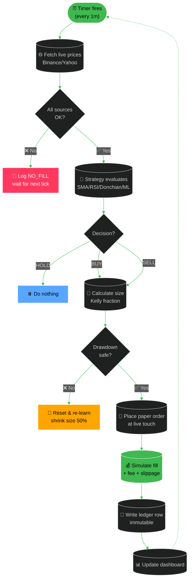

</div>

### 2️⃣ Honesty Check (What Must Be True Before a Fill)

<div align="center">

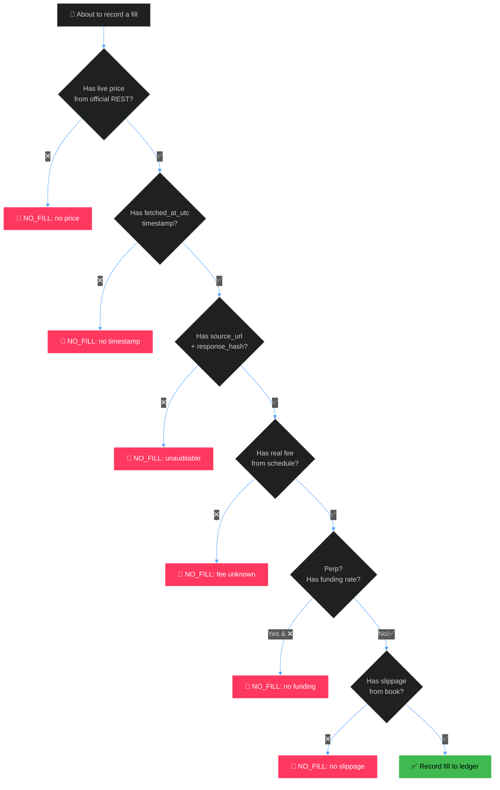

</div>

### 3️⃣ Live-Trading Safety Gate

<div align="center">

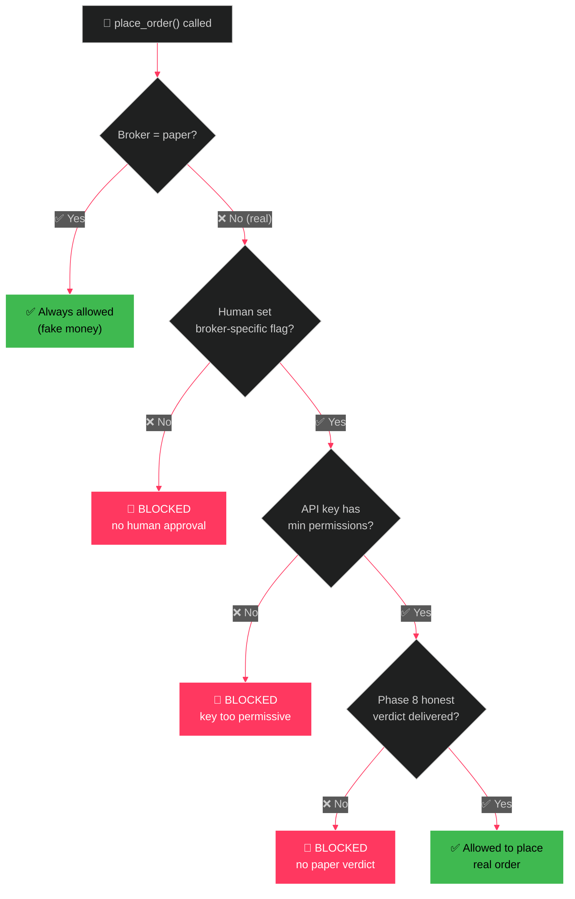

</div>

### 4️⃣ Strategy Backtest Flow

<div align="center">

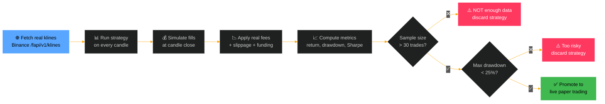

</div>

### 5️⃣ Kelly Sizing + Reset Loop

<div align="center">

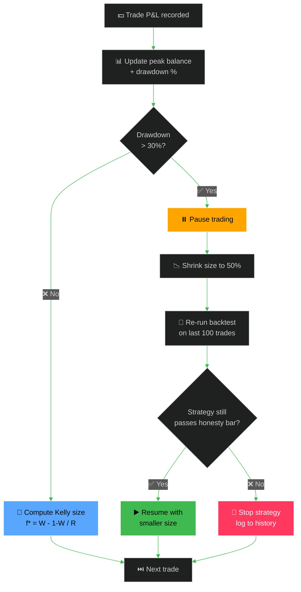

</div>

### 6️⃣ Build Phases (Roadmap)

<div align="center">

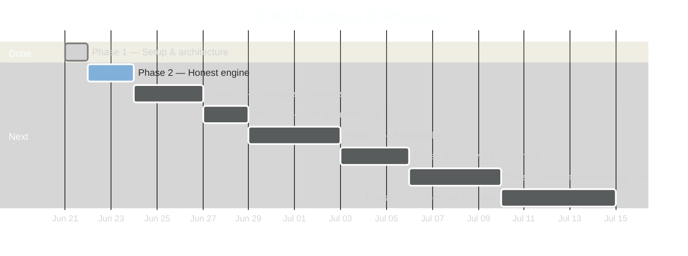

</div>

---

## 🧩 The Strategies Explained (Beginner-Friendly)

<div align="center">

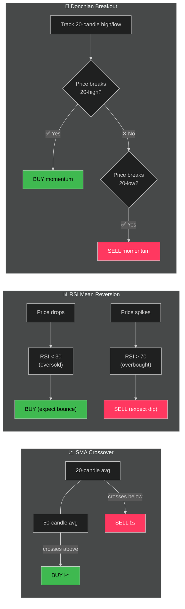

</div>

| Strategy | When it works | When it fails |
|----------|---------------|---------------|
| **SMA Crossover** | Strong trends | Choppy sideways markets (whipsaw) |
| **RSI Mean Reversion** | Range-bound markets | Strong trends (catches falling knife) |
| **Donchian Breakout** | Volatility expansion | False breakouts in low volume |
| **ML Predictor** | Adaptive, learns from P&L | Needs >100 trades to stabilize |

---

## 📂 Project Structure

```
Trading Bot/
├── 🐍 tradingbot/                  # Main package
│   ├── __init__.py
│   ├── ⚙️ config.py                # Loads .env, paper balance defaults
│   ├── 🧠 engine.py                # HonestEngine — balances, ledger, fills
│   ├── 📏 sizing.py                # Kelly criterion + drawdown reset
│   ├── 💵 prices.py                # Live price/fee/funding fetchers
│   ├── 🏦 real_exchange.py         # Real-API wrapper (Binance/Alpaca)
│   ├── ⏪ backtest.py              # Backtester on real klines
│   ├── 🌐 dashboard.py             # Glassmorphic web UI
│   ├── 💬 sentiment.py             # Lexicon-based news scoring
│   ├── 🔌 brokers/
│   │   ├── 📜 base.py              # The 6-method contract
│   │   ├── 💰 paper_adapter.py     # Default broker (always on)
│   │   ├── 🟡 binance_adapter.py   # Real Binance (gated)
│   │   ├── 🦙 alpaca_adapter.py    # Real Alpaca (gated)
│   │   ├── 🏛️ ibkr_adapter.py      # Real IBKR (gated)
│   │   ├── 🚦 live_gate.py         # Per-broker safety gate
│   │   └── 🎭 mock_adapter.py      # For tests
│   └── 🧩 strategies/
│       ├── 📜 base.py              # BaseStrategy ABC
│       ├── 📈 sma_crossover.py
│       ├── 📊 rsi_mean_reversion.py
│       ├── 🚀 breakout.py
│       └── 🤖 ml_predictor.py
├── 🧪 tests/
│   └── ✅ test_broker_contract.py  # 5/5 contract tests
├── 🛠️ scripts/
│   ├── 1️⃣ step1_smoke.py
│   ├── 2️⃣ step2_cycle.py
│   ├── 3️⃣ step3_backtest.py
│   └── 4️⃣ step4_paper_run.py
├── 📋 CLAUDE.md                    # Project rules (read first!)
├── 📊 PHASE1_AUDIT.md              # Honesty audit findings
├── 📝 PROGRESS.md                  # Phase todo list
├── 📚 SOURCES.md                   # Every fee/endpoint cited
├── 📦 requirements.txt
├── 🚀 run.sh                       # Launch script
└── 📖 README.md                    # ← you are here
```

---

## 🚀 Quick Start

### Prerequisites
- Python 3.14+
- ~50MB disk space
- Internet connection (for live price feeds)

### Installation

```bash
# 1. Clone or enter the project
cd "/Users/soumyachakraborty/Documents/D/Trading Bot"

# 2. Create virtual env (if not done)
python3 -m venv .venv
.venv/bin/pip install -r requirements.txt
```

### Run the Test Suite (proves the honesty contract)

```bash
PYTHONPATH=. .venv/bin/python tests/test_broker_contract.py
```

**Expected output:** ✅ 5/5 tests pass, including a **live paper BUY of BTCUSDT** at the real Binance ask price.

### Run a Single Trade Cycle

```bash
.venv/bin/python scripts/step2_cycle.py
```

### Launch the Dashboard

```bash
.venv/bin/python tradingbot/dashboard.py
# Open http://localhost:8000 in your browser
```

---

## 📐 How Position Sizing Works (For Beginners)

> *"How much of my fake money should I bet on this trade?"*

We use the **Fractional Kelly Criterion** — a math formula that says:

```
f* = W − (1 − W) / R

Where:
  f* = fraction of bankroll to bet
  W  = win rate (% of trades that profit)
  R  = payout ratio (avg win ÷ avg loss)
```

**Example:** If you win 60% of trades and your wins are 2× your losses, you should bet **40%** of your bankroll per trade. We use **¼ of that** (10%) to be safer.

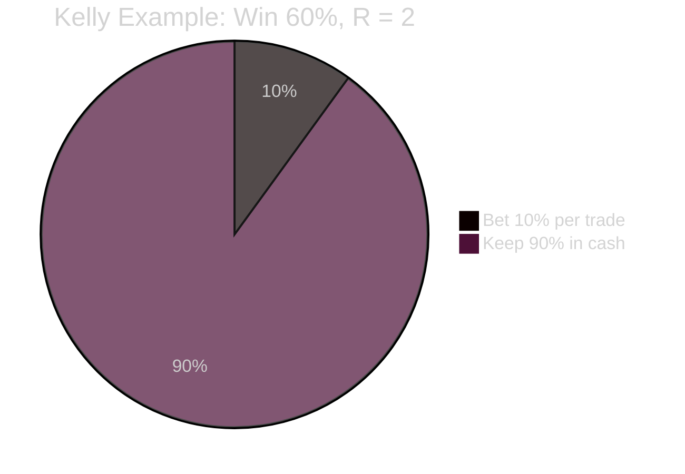

If the bot loses >30% of its peak balance, it **pauses, shrinks size by 50%, and re-validates the strategy** before resuming.

---

## 🤝 Contributing

This project is in active development across 8 phases. Before contributing:

1. 📖 Read [`CLAUDE.md`](./CLAUDE.md) — the rules are non-negotiable
2. 📋 Check [`PROGRESS.md`](./PROGRESS.md) for current phase
3. 📚 Check [`SOURCES.md`](./SOURCES.md) before adding any new fee/endpoint
4. 🧪 All broker adapters must pass `tests/test_broker_contract.py`
5. 🚫 **Never** hardcode a price, fee, or news item

---

## 📜 License

MIT — see `LICENSE` file. (Add one if missing.)

---

<div align="center">

### 🌟 Star this repo if you believe paper trading should be honest.

**Built with 🛡️ honesty by a bot that refuses to lie to itself.**

</div>
